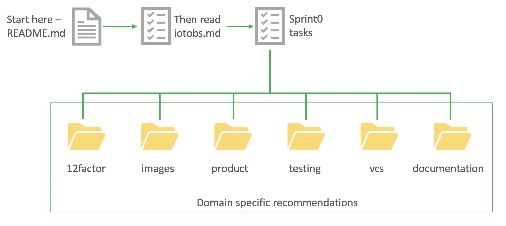

# Getting Started #

> This repo contains observations and recommendations for the IoT Virtual team currently working to deliver a scale model of the NASA JPL Mars Rover. This project also facilitates capability and skills development for staff in areas such as IoT, python programming, micro-controllers, cloud-native concepts and product development.

## Repo Organization ##

The below diagram illustrates the sub-directory layout for this repo, and is representative of the structure that is being recommended for the master project.

