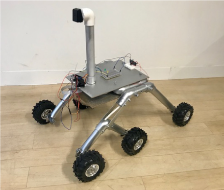

# Project Overview #

## MARS Infrastructure Project TK-18/A ##

> Early Warning and Reconnaissance Platform | Objective - Enhance Crew Survivability

## Observations and Recommendations - IoT Mars Rover project ##

### Observations ###

#### Current tooling ####

* slack
* zoom
* github
* trello
* atom
* vscode
* troubleshoot and other stuff in word document on onedrive
* code documentation on github
* test suite is a series of test scripts (unit and integration)

#### Languages ####

* Python
* bash (telemetry)
* Pulse uses bash
* JSON

#### Current Git strategy ####

Git branching is used for storing code for different run environments since the configuration is stored in code.
Peer review, offline PR reviews: minimal.

#### Deploy process ####

1. ssh to pi
2. git on pi
3. git status
4. git add --all
5. git commit and push to clean up
need to use git ignore for cache files (what other files need to be removed?)
6. develop on laptop then push to staging, pull to pi

### Recommendations ###

For the collaboration work, the most immediate items for workflow improvement would be:

1. Version Control: Switch to trunk based development for releases and use short lived branches for new features
2. 12 Factor: Separate config from code. This will aid with point 1. Pull all configuration from the code base and have those values generated via other means such as config files, environment variables, command-line flags.
3. [Unit Testing](https://github.com/jricho/iot/blob/master/testing/testing.md): Python has unit testing capabilities and this can be used to verify the codebase is working as intended. I would not recommend to go over-board with unit testing every function though, preferably scope the unit testing to package level. By using unit tests and test matrices, the IoT can have confidence when they start the work on item 2.
4. Decide who a product owner should be. The product owner cannot be in the dev team.  Adam is a great candidate.
5. Create a backlog and have the product owner prioritise the items
6. Not a must but it can help create some order: setup sprints at regular intervals so it is understood what items from the backlog are in active development.
7. Documentation: use Markdown to generate documentation, to allow this documentation to be checked into the source code repository.
8. Continuous Integration: Investigate the use of a CI system to handle unit testing automatically as part of a pipeline process.

Other notes:

* Need to figure out product backlog and scrum roles
* Is there a list of documentation?  Seems spread over a few places, need to consolidate
* Kevin to send link to the trello board.